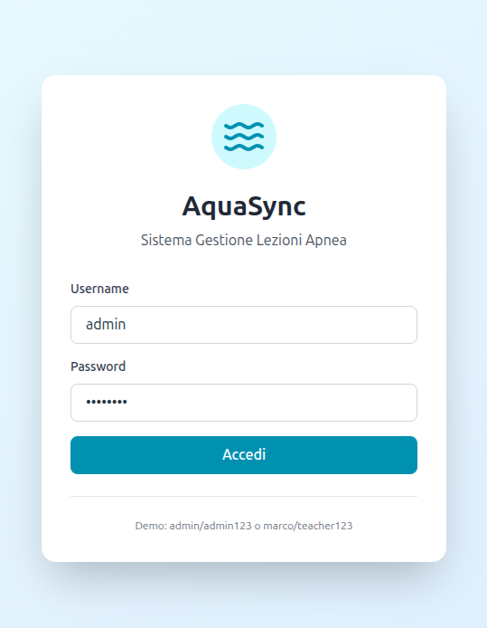
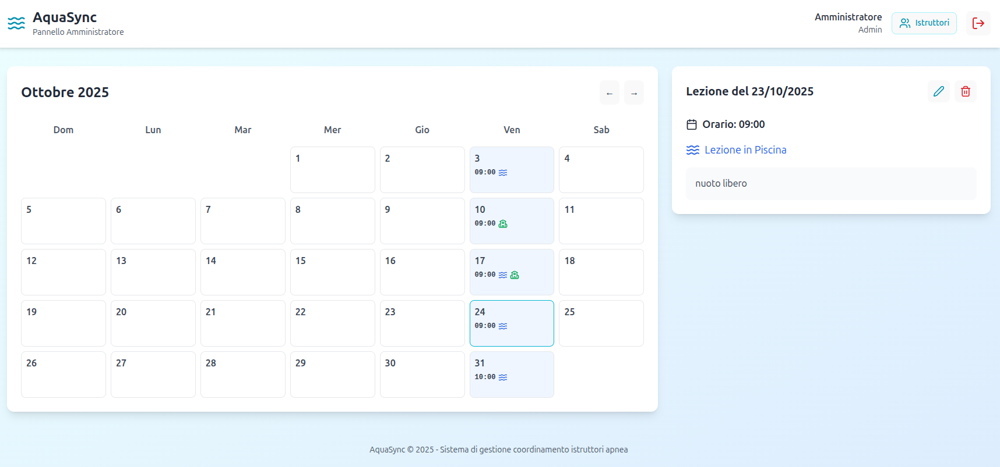
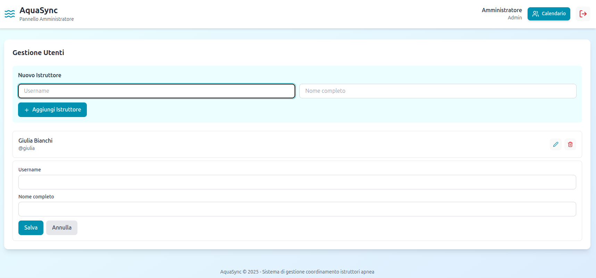
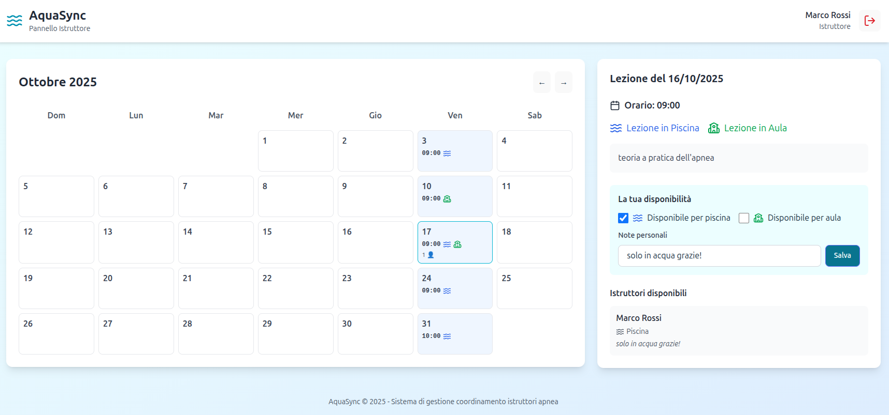

# 🏊 AquaSync - Sistema Gestione Lezioni Apnea

Un sistema completo per la gestione e coordinamento delle lezioni di apnea, progettato per facilitare la comunicazione tra amministratori e istruttori.

## 🌐 Demo Live

**🚀 [Prova AquaSync](https://aquasync-o-matic.netlify.app)**

### Credenziali Demo:
- **👑 Admin**: `admin` / `admin123`
- **👨‍🏫 Istruttore**: `marco` / `teacher123`

---

## 📸 Screenshots

### Schermata di Login


### Dashboard Amministratore


### Gestione Utenti


### Vista Istruttore


---

## ✨ Funzionalità Principali

### 👑 **Per gli Amministratori:**
- 📅 **Creazione e gestione lezioni** con orari specifici
- 🔄 **Lezioni ricorrenti** (giornaliere, settimanali, mensili, annuali)
- 🏊 **Configurazione tipo lezione** (Piscina/Aula)
- 👥 **Gestione completa istruttori** (CRUD con password visibili)
- 📝 **Descrizioni dettagliate** per ogni lezione
- 👁️ **Visibilità totale** su disponibilità istruttori
- 🔔 **Sistema notifiche** con ultime disponibilità inserite
- 📊 **Statistiche dettagliate** per istruttore
- 🗑️ **Eliminazione batch** di lezioni ricorrenti

### 👨‍🏫 **Per gli Istruttori:**
- ✅ **Dichiarazione disponibilità** per piscina e/o aula
- ❌ **Ritiro disponibilità** in qualsiasi momento
- 📝 **Note personali** per ogni lezione
- 📅 **Vista calendario** con tutte le lezioni programmate
- 🔄 **Aggiornamenti real-time** delle proprie disponibilità

### 🎨 **Design e UX:**
- 📱 **Completamente responsive** (mobile-first)
- 🎯 **Interfaccia intuitiva** con icone Lucide
- 🌊 **Tema acquatico** con colori cyan/blu
- ⚡ **Performance ottimizzate** con Vite
- 🔒 **Sicurezza** con Row Level Security (RLS)
- 🎨 **Favicon personalizzata** con tema acquatico

---

## 🛠️ Stack Tecnologico

### Frontend:
- ⚛️ **React 19** - UI Library moderna
- ⚡ **Vite** - Build tool super veloce
- 🎨 **Tailwind CSS** - Styling utility-first
- 🎯 **Lucide React** - Icone moderne
- 📱 **Responsive Design** - Mobile-first

### Backend:
- 🗄️ **Supabase** - Backend-as-a-Service
- 🔐 **PostgreSQL** - Database relazionale
- 🛡️ **Row Level Security** - Sicurezza avanzata
- 🔑 **Real-time subscriptions** - Aggiornamenti live

### Deploy:
- 🌐 **Netlify** - Hosting gratuito
- 🔄 **CI/CD automatico** - Deploy da GitHub
- 🌍 **HTTPS** - Certificato SSL gratuito
- ⚡ **CDN globale** - Performance ottimizzate

---

## 🚀 Quick Start

### 1. Clona il Repository
```bash
git clone https://github.com/Pioshin/Aquasync.git
cd Aquasync
```

### 2. Installa Dipendenze
```bash
npm install
```

### 3. Configura Environment Variables
```bash
cp .env.example .env.local
```

Modifica `.env.local` con le tue credenziali Supabase:
```env
VITE_SUPABASE_URL=your_supabase_url
VITE_SUPABASE_ANON_KEY=your_supabase_anon_key
```

### 4. Avvia in Sviluppo
```bash
npm run dev
```

### 5. Build per Produzione
```bash
npm run build
```

---

## 🗄️ Database Schema

### Tabelle Principali:

**`users`** - Gestione utenti
```sql
- id (UUID, PK)
- username (TEXT, UNIQUE)
- name (TEXT)
- role (admin/teacher)
- created_at, updated_at
```

**`lessons`** - Lezioni programmate
```sql
- id (UUID, PK)
- date (DATE)
- time (TIME)
- pool (BOOLEAN)
- classroom (BOOLEAN)
- description (TEXT)
- created_by (UUID, FK)
```

**`teacher_availability`** - Disponibilità istruttori
```sql
- id (UUID, PK)
- lesson_id (UUID, FK)
- teacher_id (UUID, FK)
- pool (BOOLEAN)
- classroom (BOOLEAN)
- note (TEXT)
```

---

## 🔧 Configurazione Supabase

### 1. Crea Progetto Supabase
1. Vai su [supabase.com](https://supabase.com)
2. Crea nuovo progetto
3. Ottieni URL e API Key

### 2. Esegui Script SQL
Copia e incolla il contenuto di `/sql/schema.sql` nell'editor SQL di Supabase.

### 3. Configura RLS Policies
Le policy di sicurezza sono incluse nello schema per:
- Accesso admin completo
- Accesso teacher limitato alle proprie disponibilità

---

## 🚢 Deploy

### Deploy su Netlify (Raccomandato)

1. **Fork/Clone** questo repository
2. **Connetti** a Netlify
3. **Configura** build settings:
   - Build command: `npm run build`
   - Publish directory: `dist`
4. **Aggiungi** environment variables:
   - `VITE_SUPABASE_URL`
   - `VITE_SUPABASE_ANON_KEY`
5. **Deploy** automatico ad ogni push!

### Deploy su Vercel
Stessi step, ma con Vercel invece di Netlify.

---

## 🧪 Testing

### Credenziali Demo Predefinite:
- **Admin**: `admin` / `admin123`
- **Teacher 1**: `marco` / `teacher123`
- **Teacher 2**: `giulia` / `teacher123`

### Workflow di Test:
1. **Login come admin** → Crea lezioni
2. **Login come teacher** → Dichiara disponibilità
3. **Torna admin** → Visualizza disponibilità
4. **Test responsive** → Verifica mobile UX

---

## 🛣️ Roadmap Future

### v2.0 Pianificato:
- 📧 **Notifiche email** automatiche
- 📅 **Calendario Google** sync
- 📊 **Dashboard analytics**
- 🔔 **Push notifications**
- 📱 **App mobile nativa**
- 🌍 **Multi-lingue** (EN/IT)

### v2.5 Pianificato:
- 🎓 **Gestione corsi** completi
- 💰 **Sistema pagamenti**
- 📄 **Certificazioni digitali**
- 📈 **Reportistica avanzata**

---

## 🤝 Contributing

Contributi benvenuti! Per contribuire:

1. 🍴 **Fork** il progetto
2. 🌿 **Crea** feature branch (`git checkout -b feature/AmazingFeature`)
3. 💾 **Commit** le modifiche (`git commit -m 'Add AmazingFeature'`)
4. 📤 **Push** al branch (`git push origin feature/AmazingFeature`)
5. 🔄 **Apri** Pull Request

---

## 📄 Licenza

Distribuito sotto licenza MIT. Vedi `LICENSE` per maggiori informazioni.

---

## 📞 Contatti

**Progetto Link**: [https://github.com/Pioshin/Aquasync](https://github.com/Pioshin/Aquasync)
**Demo Live**: [https://aquasync-o-matic.netlify.app](https://aquasync-o-matic.netlify.app)

---

## 🙏 Ringraziamenti

- [React](https://reactjs.org/) - UI Library
- [Supabase](https://supabase.com/) - Backend Platform
- [Tailwind CSS](https://tailwindcss.com/) - CSS Framework
- [Lucide](https://lucide.dev/) - Icon Library
- [Netlify](https://netlify.com/) - Hosting Platform

---

## ☕ Supporta il Progetto

Se AquaSync ti è utile e vuoi supportare lo sviluppo:

<div align="center">

[](https://www.buymeacoffee.com/pioshin)

**⭐ Se questo progetto ti è utile, lascia una stella! ⭐**

🤖 **Generato con [Claude Code](https://claude.ai/code)**

</div>
